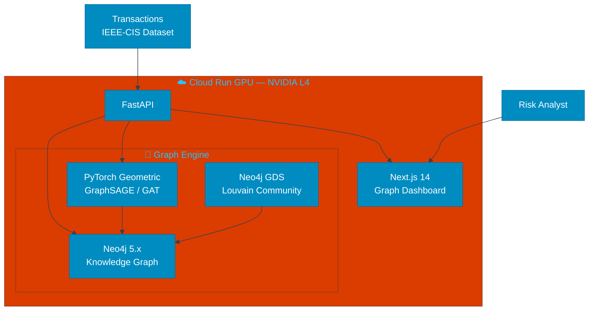
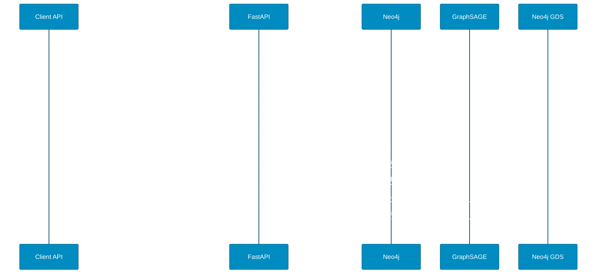
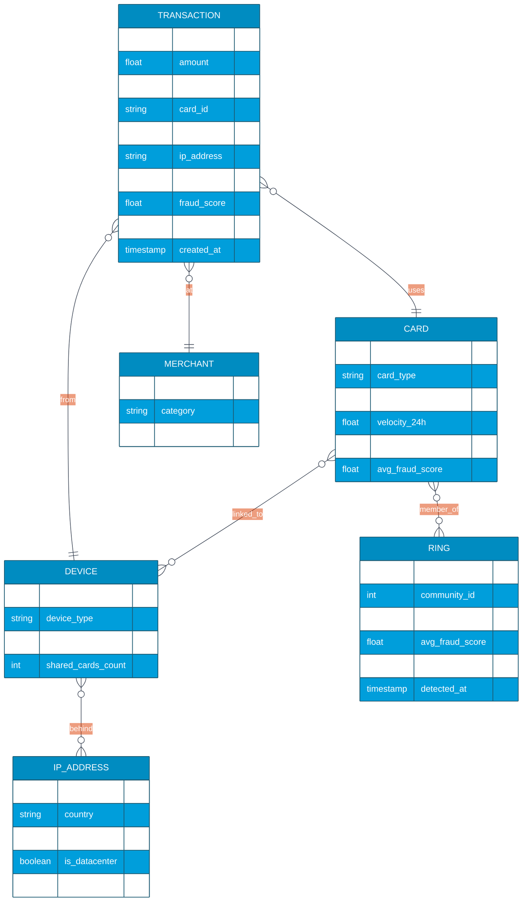
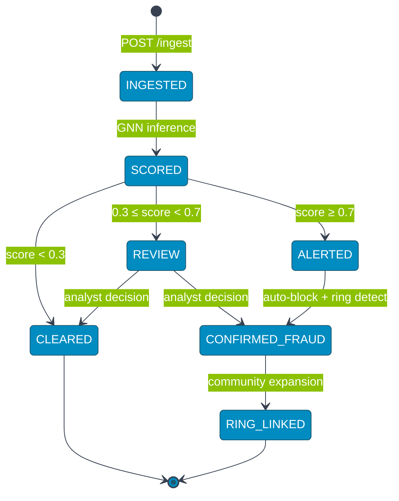

# GraphFraud — Détection de fraude par graphe de connaissance

> Les fraudeurs ne travaillent pas seuls. Trouvez les réseaux, pas juste les individus.

[](https://fastapi.tiangolo.com)
[](https://nextjs.org)
[](https://neo4j.com)
[](https://pytorch-geometric.readthedocs.io)
[](https://cloud.google.com/run)

---

## Vue d'ensemble

GraphFraud est une plateforme de détection de fraude basée sur les graphes de connaissance. Elle modélise les relations entre entités (comptes, appareils, IP, marchands, bénéficiaires) comme un graphe Neo4j et applique des Graph Neural Networks (GNN) pour détecter des anneaux de fraude que les modèles tabulaires manquent.

**Domaine :** Fraude financière / Cybersécurité / Risk Management  
**Dataset :** [IEEE-CIS Fraud Detection (Kaggle)](https://www.kaggle.com/competitions/ieee-fraud-detection) — 590 540 transactions  
**Déploiement :** Cloud Run GPU (NVIDIA L4) — GCP `atr.guillaume@gmail.com`  
**Sous-domaine :** graphfraud.wikolabs.com

---

## Stack technique

| Couche | Technologie | Rôle |
|--------|------------|------|
| Frontend | Next.js 14, TypeScript, Tailwind CSS, Sigma.js v2, Recharts | Visualisation graphe interactif, ring detection UI |
| Backend | FastAPI (Python 3.11), Uvicorn | API graphe, prédictions GNN, alertes |
| Graph DB | **Neo4j 5.x** (APOC, GDS) | Stockage graphe transactions, Cypher queries |
| GNN | **PyTorch Geometric** (GraphSAGE, GAT) | Node classification — fraudeur/légitime |
| Feature engineering | NetworkX, pandas, numpy | Ring detection, community detection, centrality |
| Community detection | Neo4j GDS (Louvain, WCC) | Clusters suspects |
| ML classique | XGBoost (fallback) | Baseline features tabulaires |
| Infra | Docker Compose, Cloud Build GCP, NVIDIA L4 | GPU pour inférence GNN |

### backend/requirements.txt
```
fastapi==0.111.0
uvicorn[standard]==0.29.0
torch==2.3.0
torch-geometric==2.5.3
neo4j==5.20.0
networkx==3.3
xgboost==2.0.3
pandas==2.2.2
numpy==1.26.4
scikit-learn==1.4.2
asyncpg==0.29.0
sqlalchemy[asyncio]==2.0.30
pydantic==2.7.1
```

---

## Architecture mono-repo

```
graphfraud/
├── frontend/
│   ├── src/app/
│   │   ├── page.tsx              # Dashboard alertes fraude
│   │   ├── graph/                # Sigma.js graphe interactif
│   │   ├── rings/                # Anneaux de fraude détectés
│   │   └── entity/[id]/          # Profil entité + neighbors
│   └── src/components/
│       ├── GraphCanvas.tsx       # Sigma.js v2 graph viz
│       ├── RingInspector.tsx     # Ring de fraude expandable
│       ├── EntityCard.tsx        # Métriques nœud (degree, betweenness)
│       ├── AlertTimeline.tsx     # Timeline alertes
│       └── RiskBadge.tsx         # Score GNN 0-100
├── backend/
│   ├── app/
│   │   ├── main.py
│   │   ├── routers/
│   │   │   ├── transactions.py   # POST /ingest + GET /graph
│   │   │   ├── predict.py        # POST /predict (GNN score)
│   │   │   └── rings.py          # GET /rings (community detection)
│   │   ├── services/
│   │   │   ├── graph_builder.py  # Neo4j entity-relationship graph
│   │   │   ├── gnn_model.py      # GraphSAGE node classifier
│   │   │   ├── ring_detector.py  # Louvain + WCC (Neo4j GDS)
│   │   │   └── features.py       # Centrality, velocity, shared-IP
│   │   └── models/
│   │       ├── transaction.py
│   │       └── alert.py
│   ├── requirements.txt
│   └── Dockerfile
├── cloudbuild.yaml
└── .github/workflows/deploy.yml
```

---

## Diagrammes UML

### Architecture système



### Séquence — Ingestion + scoring GNN



### Modèle de données graphe (ER)



### État d'une alerte fraude



---

## PRD

### Problème
Les modèles de fraude tabulaires (XGBoost sur features d'une transaction unique) atteignent ~95% AUC mais manquent les fraudes organisées en réseau : un fraudeur utilise 5 cartes différentes depuis 3 appareils partageant la même IP masquée par VPN. La relation inter-entités n'est pas capturée dans une feature vector.

### Solution
GraphFraud modélise chaque transaction comme un événement sur un graphe de connaissance : CARD → DEVICE → IP → MERCHANT. Les GNN (GraphSAGE) apprennent des représentations vectorielles en agrégeant les voisinages. La détection de communautés (Louvain) identifie les anneaux de fraude coordonnés.

### Utilisateurs cibles
| Persona | Besoin |
|---------|--------|
| Risk Analyst | Visualiser les anneaux, comprendre les connexions suspectes |
| Fraud Investigator | Explorer le graphe d'une entité, remonter aux complices |
| ML Engineer | Entraîner/évaluer les GNN sur des données fraîches |

### OKRs
- Recall fraude > 90% (pas de fraude manquée) à precision > 85%
- Détection ring en < 500ms (inférence GPU)
- AUC ROC > 0.97 sur IEEE-CIS test set

---

## User Stories

```
US-01 [Analyst] En tant qu'analyste risque,
      je veux voir le graphe de relations d'une transaction suspecte
      afin d'identifier si la carte appartient à un ring connu.

US-02 [Investigator] En tant qu'enquêteur fraude,
      je veux explorer les 2 niveaux de voisinage d'une entité
      (carte → appareils → IPs → autres cartes)
      afin de remonter au nœud pivot du réseau frauduleux.

US-03 [Système] En tant que moteur de scoring,
      je veux calculer le fraud score d'une nouvelle transaction
      en moins de 200ms (GPU GraphSAGE)
      afin de bloquer en temps réel avant autorisation.

US-04 [ML Engineer] En tant qu'ingénieur ML,
      je veux réentraîner le GNN sur les nouvelles transactions labellisées
      afin que le modèle s'adapte aux nouvelles tactiques de fraude.

US-05 [Analyst] En tant qu'analyste,
      je veux une explication du fraud score
      (quelles relations ont le plus contribué)
      afin de justifier le blocage auprès de la compliance.
```

---

## Règles métier

Simulables dans l'UI avec les données IEEE-CIS pré-chargées.

| # | Règle | Description | Simulable UI |
|---|-------|-------------|-------------|
| R1 | Velocity check | > 3 transactions/heure depuis la même carte → risk +30 | ✅ Timeline viz |
| R2 | Shared device | 1 device utilisé par > 5 cartes différentes → alerte ring | ✅ Ring inspector |
| R3 | VPN/datacenter IP | IP reconnue datacenter/VPN → risk +20 | ✅ IP badge |
| R4 | Community size | Communauté Louvain > 10 nœuds → ring_alert=true | ✅ Ring card |
| R5 | GNN threshold | fraud_score ≥ 0.7 → blocage automatique | ✅ Score gauge |
| R6 | Merchant chargeback | merchant chargeback_rate > 5% → risk +15 | ✅ Merchant profile |
| R7 | Cross-border | Carte FR, transaction US, device CN → anomaly | ✅ Geo heatmap |
| R8 | Card BIN mismatch | BIN indique pays différent de l'IP → risk +25 | ✅ BIN checker |
| R9 | New entity | Carte < 24h d'ancienneté avec montant > 500€ → review | ✅ Entity age badge |
| R10 | Ring propagation | Confirmation fraude d'un nœud → re-score tous ses voisins | ✅ Propagation animate |

---

## Spécification API

**Base URL :** `http://graphfraud.wikolabs.com/api/v1`

### POST /ingest
```json
{
  "transaction_id": "T_12345",
  "amount": 849.99,
  "card_id": "C_abc123",
  "device_id": "D_xyz789",
  "ip_address": "185.220.101.47",
  "merchant_id": "M_shop01",
  "timestamp": "2024-03-15T14:32:00Z"
}
// Response: {"fraud_score": 0.92, "is_alert": true, "ring_id": "R_47", "community_size": 12}
```

### GET /graph/{entity_id}
```json
// Response: {
//   "nodes": [{"id": "C_abc123", "type": "CARD", "fraud_score": 0.92}, ...],
//   "edges": [{"source": "C_abc123", "target": "D_xyz789", "rel": "USED_BY"}, ...],
//   "ring_detected": true
// }
```

### GET /rings
```json
// Response: {
//   "rings": [
//     {"ring_id": "R_47", "community_id": 47, "size": 12, "avg_score": 0.87, "entities": [...]}
//   ]
// }
```

### POST /retrain
```json
{"labeled_transactions": [...], "epochs": 10}
// Response: {"job_id": "train_xyz", "status": "queued"}
```

---

## Simulation UI

| Composant | Description |
|-----------|-------------|
| **Graph Canvas** | Sigma.js v2 : nœuds colorés par type (carte=bleu, device=vert, IP=orange, merchant=violet), taille = fraud_score |
| **Ring Inspector** | Clic sur un ring → expand tous les membres, show connections |
| **Entity Card** | Panel latéral : degree centrality, betweenness, shared_devices, velocity |
| **Score Gauge** | Jauge 0-100 avec seuils colorés (vert/orange/rouge) |
| **Alert Timeline** | Flux temps réel des alertes avec sparkline score |
| **Propagation Demo** | Bouton "confirm fraud" → animation propagation re-scoring voisins |

---

## Dataset

**Kaggle :** [IEEE-CIS Fraud Detection](https://www.kaggle.com/competitions/ieee-fraud-detection)

```bash
kaggle competitions download -c ieee-fraud-detection -p backend/app/data/
```

**Contenu :** 590 540 transactions de paiement en ligne avec 433 features (identité + transaction). Label `isFraud` (3.5% de fraudes). Parfait pour démontrer les limites des modèles tabulaires vs GNN sur des patterns relationnels.

**Préparation graphe :**
```python
# graph_builder.py — construction Neo4j depuis IEEE-CIS
for _, row in df.iterrows():
    neo4j.run("""
        MERGE (c:Card {id: $card_id})
        MERGE (d:Device {id: $device_id})
        MERGE (ip:IP {addr: $ip})
        MERGE (m:Merchant {id: $merchant_id})
        CREATE (t:Transaction {id: $tx_id, amount: $amount, fraud: $fraud})
        CREATE (t)-[:USED_CARD]->(c)
        CREATE (t)-[:FROM_DEVICE]->(d)
        CREATE (t)-[:FROM_IP]->(ip)
        CREATE (t)-[:AT_MERCHANT]->(m)
        CREATE (c)-[:USED_ON]->(d)
        CREATE (d)-[:BEHIND]->(ip)
    """, **row)
```

---

## Modèle GNN — GraphSAGE

```python
# gnn_model.py
import torch
from torch_geometric.nn import SAGEConv
import torch.nn.functional as F

class FraudGraphSAGE(torch.nn.Module):
    def __init__(self, in_channels, hidden_channels, out_channels):
        super().__init__()
        self.conv1 = SAGEConv(in_channels, hidden_channels)
        self.conv2 = SAGEConv(hidden_channels, hidden_channels)
        self.lin = torch.nn.Linear(hidden_channels, out_channels)

    def forward(self, x, edge_index):
        x = F.relu(self.conv1(x, edge_index))
        x = F.dropout(x, p=0.3, training=self.training)
        x = F.relu(self.conv2(x, edge_index))
        return torch.sigmoid(self.lin(x))  # Node-level fraud probability
```

---

## Déploiement Cloud Run GPU

### cloudbuild.yaml
```yaml
steps:
  - name: 'gcr.io/cloud-builders/docker'
    args: ['build', '-t', 'gcr.io/$PROJECT_ID/graphfraud-backend', './backend']
  - name: 'gcr.io/cloud-builders/docker'
    args: ['push', 'gcr.io/$PROJECT_ID/graphfraud-backend']
  - name: 'gcr.io/google.com/cloudsdktool/cloud-sdk'
    entrypoint: gcloud
    args:
      - run
      - deploy
      - graphfraud-backend
      - --image=gcr.io/$PROJECT_ID/graphfraud-backend
      - --region=us-central1
      - --gpu=1
      - --gpu-type=nvidia-l4
      - --memory=16Gi
      - --cpu=4
      - --allow-unauthenticated
```

### .github/workflows/deploy.yml
```yaml
name: Deploy GraphFraud
on:
  push:
    branches: [main]
jobs:
  deploy:
    runs-on: ubuntu-latest
    steps:
      - uses: actions/checkout@v4
      - name: Build & Push Docker (frontend)
        run: |
          docker build -t graphfraud-frontend ./frontend
          docker tag graphfraud-frontend gcr.io/${{ secrets.GCP_PROJECT }}/graphfraud-frontend
          docker push gcr.io/${{ secrets.GCP_PROJECT }}/graphfraud-frontend
      - name: Trigger Cloud Build (backend GPU)
        run: |
          gcloud builds submit --config cloudbuild.yaml \
            --project ${{ secrets.GCP_PROJECT }}
        env:
          GOOGLE_CREDENTIALS: ${{ secrets.GCP_SA_KEY }}
```

---

## Concepts ML avancés

### GraphSAGE vs Graph Attention Network (GAT)
- **GraphSAGE** : agrégation par sampling (mean/max/LSTM) — efficace pour grands graphes, inductif (généralise sur nouveaux nœuds)
- **GAT** : attention weights sur les voisins — plus expressif mais plus lent
- GraphFraud utilise GraphSAGE en prod pour la latence, GAT en expérimental

### Homophily dans les graphes de fraude
Les fraudeurs se connectent à d'autres fraudeurs (même device, même IP). L'homophilie du graphe fait que la classification par GNN surpasse les features individuelles : un nœud légitime connecté à 5 fraudeurs hérite d'un risk score élevé même sans features suspectes propres.

### Neo4j GDS — Community Detection
```cypher
// Louvain community detection
CALL gds.louvain.write('fraudGraph', {
  writeProperty: 'communityId',
  relationshipWeightProperty: 'weight'
})
YIELD communityCount, modularity

// Weakly Connected Components — identifier les rings isolés
CALL gds.wcc.write('fraudGraph', {writeProperty: 'componentId'})
YIELD componentCount
```

---

## Roadmap

### Phase 1 — MVP
- [ ] Neo4j schema + ingestion IEEE-CIS dataset
- [ ] GraphSAGE node classification (GPU)
- [ ] Sigma.js graph visualization
- [ ] Fraud ring detection (WCC)

### Phase 2 — Advanced
- [ ] GAT attention-based model
- [ ] Real-time ingestion via Kafka
- [ ] Neo4j GDS Louvain community detection
- [ ] Explainability (GNNExplainer)

### Phase 3 — Expert
- [ ] Temporal GNN (transactions séquentielles)
- [ ] Heterogeneous graph (CARD/DEVICE/IP nœuds différents)
- [ ] Federated learning (multi-banque)
- [ ] Integration Stripe Radar / Adyen API

---

*Un produit [Wikolabs](https://wikolabs.com) — Intelligence artificielle appliquée aux métiers*
